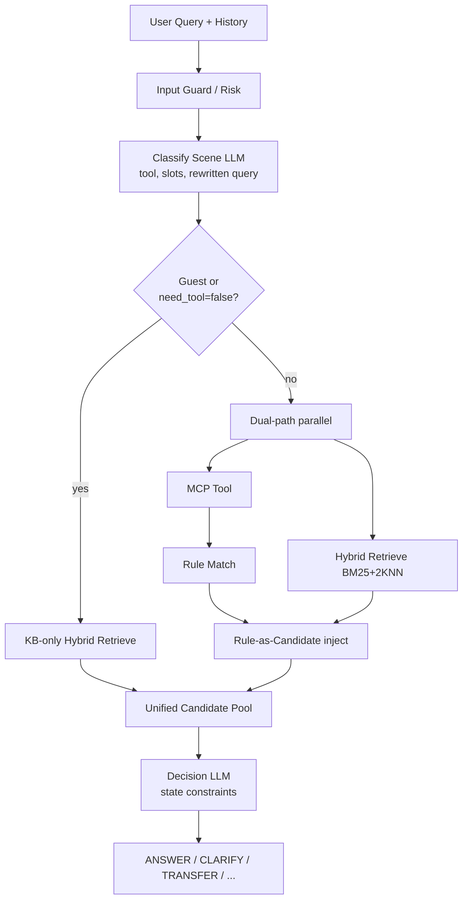
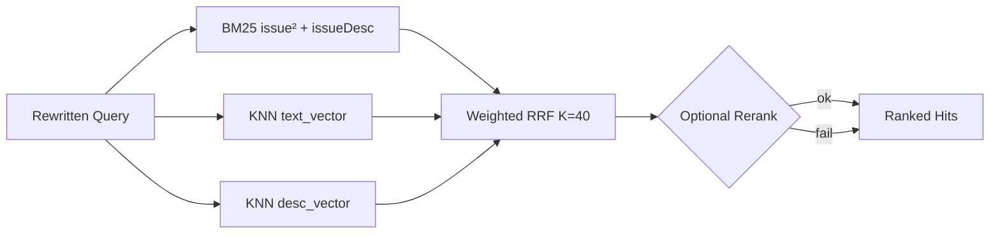

# Customer-Service LLM Runtime Harness

**Subtitle:** Governed Takeover, Clarification-Aware Evidence, and Trace-Driven Improvement
**Target:** KDD Applied Data Science  
**Authors:** Anonymous (review draft)  
**Status:** Reframed around deployed LLM takeover runtime; experiments can be extended with post-launch metrics

> **审阅说明：** 本文档是 `main.tex` 的可读版本。`main.tex` 已按 KDD 减分项优化（见文末「投稿优化备忘」）。

**Keywords:** large language models, customer service, retrieval-augmented generation, hybrid retrieval, production systems

---

## Abstract

Enterprise customer-service assistants must let LLMs handle open-ended user language without giving them unbounded authority over account tools, policy rules, and human escalation. The paper is not just about a better RAG bot; it is about a deployed **runtime harness** for LLM takeover of customer-service decision chains.

Deployed **LangGraph runtime** (fixed DAG, not open-ended agent loop) with up to two structured-JSON LLM decisions on retrieval turns.

**Design contributions (D1–D3):**
1. **D1 — Governed runtime harness:** LLM owns semantic decisions; runtime owns permissions, state, clarification bounds, escalation, degradation, and audit.
2. **D2 — Clarification-aware evidence governance:** FAQ, MCP/account tools, and policy rules become typed auditable evidence; clarification is a first-class bounded action.
3. **D3 — Runtime readiness and trace-driven improvement funnel:** traces diagnose whether failures come from recall, ranking, candidate election, clarification, rules, tools, or action policy.

**Reusable thesis:** governed takeover, not autonomous takeover. LLMs can take over semantic judgment only because the runtime harness owns evidence, tools, clarification, escalation, and observability.

**Evaluation scope (explicit):** Offline issue-ID Hit@K on **N≈309** FAQ sessions covers the evidence/ranking/election slice of the runtime funnel. Post-launch metrics, clarification/action labels, MCP/rule cases can be added from deployment logs.

---

## 1. Introduction

Customer-service assistants combine:

- unstructured FAQ articles
- structured backend outputs (order status, KYC, balances)
- deterministic business rules

**Two common extremes:**

| Approach | Strength | Weakness |
|----------|----------|----------|
| Pure RAG | Paraphrase, long-tail | Ignores account facts & strict policy |
| Hard rule-first | Policy precision | Over-trigger, brittle on partial failure |

**Our approach:** governed LLM runtime harness. LangGraph `StateGraph` with six nodes:

```
analyze → guest_mode → classify_scene → { kb_only_retrieval | parallel_retrieval | early exit } → llm_result
```

The LLM runs **twice per turn** (when retrieval runs): scene/routing, then grounded issue/action election. Runtime gates control tools, slots, escalation, evidence assembly, timeout/fallback, and logs.

### 1.1 Design contributions (D1–D3) vs engineering

| ID | Design (novelty) | Production mechanisms (engineering) |
|----|------------------|-------------------------------------|
| **D1** | Governed runtime harness for LLM takeover | LangGraph DAG, `kcbot_llm_*`, guest KB-only, slot clarify, transfer caps, `_chain_log` |
| **D2** | Clarification-aware evidence governance | FAQ + MCP + rules as evidence; `rule_answer=None`; clarify counters |
| **D3** | Runtime readiness and trace-driven improvement funnel | Stage logs, Hit@K funnel, rerank FT, replay artifacts, post-launch metrics |

**Central claim:** LLM = semantic decision component inside a governed runtime — not a general autonomous agent benchmark.

**Reviewer-memory version:** the paper is about the serving-time runtime harness required for LLM takeover of customer service: evidence assembly, clarification, tool/rule governance, bounded action election, degradation, and replayable observability.

### 1.2 What we evaluate now vs later

| Component | Reported now | Not yet reported |
|-----------|--------------|------------------|
| Runtime funnel: recall/rerank/election (D3) | Hit@K / P@K, N≈309 | Cross-domain |
| Governed runtime harness (D1) | Deployed mechanisms | Tool F1, timeout impact |
| Clarification-aware evidence governance (D2) | Design + logs | Clarify/action accuracy, rule P/R |
| MCP / routing | — | Tool F1, timeouts |

**Empirical validation (§5):**
- **Runs 1–2:** 固定召回+通用 rerank，只换决策 LLM → 证明 runtime election 能修复弱排序，不是靠换 GPT
- **Run 3:** 不跑 LLM，只微调 rerank → 证明 takeover readiness 先卡在 evidence/ranking，不是 backbone
- **漏斗对照** (`tab:exp-funnel`): 召回 42% | 通用 rerank 57% → LLM **81%** | FT rerank **93%**（无 LLM）

### 1.3 System Overview (Figure 1)



---

## 2. Related Work

### 2.1 RAG for QA
**Prior:** Lewis et al. (2020) retrieve-then-generate; Gao et al. (2024) survey naive → modular RAG.  
**Adaptive RAG:** Self-RAG (Asai et al., ICLR 2024) learns when to retrieve + critique; Adaptive-RAG (Jeong et al., NAACL 2024) routes by query complexity; CRAG (Yan et al., 2024) corrects low-quality retrieval via evaluator + web search.  
**CS-specific:** Xu et al. (SIGIR 2024) KG-RAG for LinkedIn support tickets (+77.6% MRR, −28.6% resolution time in production).  
**Us:** Classify-stage LLM gates heterogeneous recall (`need_tool_call`, rewrite); decision-stage elects discrete issue/action over structured candidates—not free-form generation. Live MCP + rules vs offline KG construction.

### 2.2 Hybrid Retrieval + RRF
**Prior:** BM25 (Robertson & Zaragoza 2009) + dense (DPR, Contriever, SimCSE); Chen et al. (ECIR 2022) zero-shot BM25+dense via RRF (Cormack et al. 2009); Bruch et al. (2023) fusion analysis (RRF vs convex combination).  
**Us:** **Three-way** recall (BM25 + issue KNN + issueDesc KNN); **weighted** RRF (K=40, tuned weights); channel failure → skip, not abort.

### 2.3 Multi-Stage Reranking
**Prior:** Cross-encoder rerank (Nogueira & Cho 2019); late interaction (ColBERT, Khattab & Zaharia, SIGIR 2020).  
**Us:** Rerank optional; timeout → RRF order unchanged (production SLO).

### 2.4 Tool-Augmented / Agentic LLM
**Prior:** ReAct, Toolformer, ToolLLM; Agentic RAG survey (Singh et al., 2025) on planning/reflection/multi-agent RAG.  
**Us:** Scene-specific MCP + separate rule engine; tool output → typed evidence, not free-form context; governed runtime harness vs single-loop agent.

### 2.5 Task-Oriented Dialogue
**Prior:** POMDP/statistical TOD (Young et al. 2013; Wen et al. 2017); InstructTODS (Chung et al., 2023) zero-shot LLM TOD with proxy belief states.  
**Us:** LLM classify/decide + Python hard constraints (guest, counters, transfer); `classify_json` in metadata for slot reuse.

### 2.6 Neuro-Symbolic Rules in CS
**Prior:** Neurosymbolic AI (Garcez et al. 2023); rule-first CS bots short-circuit on first match.  
**Us:** Rules evaluate MCP JSON; LLM selects among rule + FAQ candidates; `rule_answer=None` (no short-circuit).

### 2.7 Positioning vs Baselines (Figure 3)

| Capability | RAG-only | Rule-first | Ours |
|------------|:--------:|:----------:|:----:|
| LLM pre-retrieval routing | — | — | ✓ |
| Dual-stage structured LLM | — | — | ✓ |
| Hybrid BM25 + multi-dense | ~ | — | ✓ |
| MCP + JSON rule grounding | — | ✓ | ✓ |
| Rule → candidate (no short-circuit) | — | — | ✓ |
| Multi-turn clarify / transfer counters | ~ | ~ | ✓ |
| Per-channel timeout & partial failure | ~ | — | ✓ |

✓ = supported · ~ = partial · — = absent

---

## 3. Problem Setting

**Input:** query `q`, history `H`, user state `u` (auth, locale)  
**Output:** action `a`, content `y`

**Actions:** ANSWER · CLARIFY · HUMAN_TRANSFER · CHITCHAT · BLOCKED

**Objectives:** factual correctness · policy compliance · multi-turn robustness · graceful degradation

---

## 4. Method

### 4.0 Notation *(new)*
- **Classify:** Γ → `(t, need_tool_call, slots, rewritten_query, action_cls)`
- **Decide:** Δ(C, q, H) → `(issue_id, action, answer)`
- **Route (code):** guest → `kb_only`; else → `parallel` (MCP only if `need_tool_call` ∧ login)
- **RRF:** `S(d) = Σ w_c / (K + rank_c(d))`, per-channel dedup, K=40, w=(1.05, 0.85, 1.0)
- **Rules:** Match(r, φ(mcp)); C = rule_candidates ∥ FAQ hits; `rule_answer=None`

### 4.1 LLM-Centric Pipeline *(C1)*

**Classify-stage LLM** (`llm_classify_scene`, prompt `cs_classify_scene_rules`):
- 7 scene labels, slots, `need_tool_call`, `rewritten_query`
- Early: CHITCHAT / BLOCKED / HUMAN_TRANSFER
- JSON output + repair; multimodal images

**Decision-stage LLM** (`node_llm_result`, prompt `cs_llm_result`):
- Elect `issue_id` over `<kb_entry>` / `<account_rule_match>` blocks
- Output: `issue_id`, `summary`, `reason`
- Optional: LLM summary + collapsible KB (`cs_answer_summary_details`)

Dedicated `kcbot_openai_api_*`; prompts from MCP/Redis/local.

### 4.2 Workflow Overview *(C1)*

| Node | Role |
|------|------|
| `analyze` | Trim history (≤21 turns, 20k chars); `reply_language` |
| `guest_mode` | `is_guest_mode` from `user_id` |
| `classify_scene` | LLM classify; may early-exit or slot CLARIFY |
| `kb_only_retrieval` | Guest FAQ-only branch |
| `parallel_retrieval` | Logged-in: FAQ ∥ MCP (MCP gated by `need_tool_call`) |
| `llm_result` | Final election |

### 4.3 LLM-Conditioned Routing *(C2)*

Classify output Γ: `(tool, need_tool_call, slots, rewritten_query, action_cls)`

| Condition | Route |
|-----------|-------|
| action_cls ∈ {CHITCHAT, BLOCKED, HUMAN_TRANSFER} | Early exit |
| guest | `kb_only_retrieval` |
| logged-in | `parallel_retrieval` (inside: skip MCP if `need_tool_call=false`) |

**Guardrails:** disabled tool → `other` + KB-only; missing MCP slots → slot CLARIFY (≤3); `classify_json` in metaData for cross-turn slots; tool switch resets counters.

### 4.4 Dual-Path + Rule Candidates *(C3)*

Parallel under `cs_parallel_total_timeout` (default 120s):

1. **Structured:** MCP aggregator → `try_rule_match` on normalized JSON  
2. **FAQ:** `async_search_hybrid_recall`

Rule hits → KB records (`category=rule`), prepended to FAQ results. **`rule_answer` always None.**

**Exception:** MCP data + no rule + `slot_clarify_count>0` → HUMAN_TRANSFER (no LLM election).

### 4.4.1 Unified candidate contract *(new core abstraction)*

Every evidence item passed to `cs_llm_result` should carry:

| Field | Purpose |
|-------|---------|
| `issue_id` / pseudo-id | Stable election target |
| `category` | FAQ vs rule vs account-derived evidence |
| provenance | Retrieval channel, MCP scene, rule id |
| rank signals | RRF score, rerank score, candidate position |
| allowed action surface | ANSWER / CLARIFY / HUMAN_TRANSFER |

**Why this matters:** heterogeneous evidence becomes comparable; partial failures still return candidates with the same interface; final decisions can be audited back to explicit candidate records.

**Algorithm (pseudocode):**

```
(t, need_tool, q̃) ← LlmClassifyScene(q, H)
if guest(u) or not need_tool:
    C ← HybridRetrieve(q̃)
else:
    (d_mcp, C_faq) ← ParallelRecall(t, q̃, u)
    R ← RuleMatch(t, d_mcp)
    C ← InjectRulesAsCandidates(R) ‖ C_faq
(a, y) ← LlmResultSelect(C, H, u)
return (a, y)
```

### 4.5 Hybrid Retrieval *(C4)*



| Channel | Field | Fetch |
|---------|-------|-------|
| BM25 | issue², issueDesc | 150 |
| KNN text | issue embedding | 10 |
| KNN desc | issueDesc embedding | 10 |

**RRF:** w_bm25=1.05, w_text=0.85, w_desc=1.0. Failed channel skipped. Rerank optional with fallback.

### 4.6 State-Constrained Decision *(C5)*

| Field | Meaning |
|-------|---------|
| `slot_clarify_count` | MCP argument clarify (classify stage) |
| `clarify_count` | Business clarify (llm_result); ≥3 → transfer |
| `user_transfer_request_count` | ≥2 → transfer |
| `accumulated_arguments` | currency / orderId / txId / chainId |
| `_chain_log` | Audit trace per request |

---

## 5. System Deployment

- **Timeouts:** per-branch + global; partial results kept  
- **Feature flags:** OpenSearch, legacy KB API, rerank, answer format  
- **Audit:** chain log per request  
- **Safety:** input/output guard, URL risk, image moderation (API layer)

---

## 6. Experiments

### 6.0 Why three runs? (rationale)

| Run | 回答什么 | 论文支撑 |
|-----|----------|----------|
| **1–2** | 在**通用 rerank** 下，**决策 LLM** 是否值得？换 Qwen / GPT-4o 是否改变结论？ | C1/C5：LLM 是 controller，检索只供候选；编排 > 换大模型 |
| **3** | 瓶颈是否在 rerank？业务微调能否 +36pp P@1 且不增延迟？ | C4：三路召回 + 可降级 rerank；工程上应投 domain FT |
| **4** | Joint：FT rerank + 决策 LLM | 强 rerank 后 LLM 还有多少边际收益？ |
| **planned** | Full agent：MCP/规则/动作 | D2 + 全 DAG |

**合成结论（正文 Table: exp-synthesis）：**
- Runs 1–2：~57% rerank → **~81% LLM**（+25pp）→ 证明「不能只做到 rerank」
- Run 1 vs 2：<1pp → 证明「不是靠换一个 GPT」
- Run 3：57% → **93% P@1**（+36pp）→ 证明「上游排序比换 backbone 更划算」
- 两者互补：架构故事（LLM 选举）+ 运维故事（rerank 微调）都要写

### 6.1 Setup (Runs 1–2)
| Item | Value |
|------|--------|
| Recall query | English translation; **concatenate** all user turns |
| LLM decision query | **Last user turn only** (`cs_llm_result`) |
| Recall pool | Top **50** (three-channel hybrid) |

### 6.2 Funnel contrast (`tab:exp-funnel`)

| Stage | Runs 1–2 (stock + LLM) | Run 3 (FT rerank, no LLM) |
|-------|------------------------|---------------------------|
| Recall Hit@1 | ~42.3 | ~42.3 |
| After rerank | ~56.6 | **92.9** |
| After LLM | **~81.5** | — | **~96.9†** (Run 4 est.) |

### 6.3 Hit@1 summary

| Run | N | Decision LLM | Recall | Rerank | LLM |
|-----|---|--------------|--------|--------|-----|
| 1 | 309 | Qwen3.5-27B | 42.07 | 56.31 | **81.23** |
| 2 | 308 | Azure GPT-4o | 42.53 | 56.82 | **81.82** |

### 6.4 Full Hit@K — Run 1 (309)

| Stage | @1 | @3 | @5 | @10 | @15 | @20 | @50 |
|-------|-----|-----|-----|------|------|------|------|
| Hybrid recall | 42.07 | 61.49 | 74.43 | 84.47 | 88.35 | 90.29 | 96.76 |
| Rerank | 56.31 | 75.80 | 84.14 | 91.59 | 94.50 | 95.15 | — |
| LLM (Qwen) | **81.23** | — | — | — | — | — | — |

### 6.5 Full Hit@K — Run 2 (308)

| Stage | @1 | @3 | @5 | @10 | @15 | @20 | @50 |
|-------|-----|-----|-----|------|------|------|------|
| Hybrid recall | 42.53 | 61.04 | 74.03 | 83.77 | 87.66 | 89.94 | 96.75 |
| Rerank | 56.82 | 75.00 | 83.77 | 91.56 | 94.48 | 95.13 | — |
| LLM (GPT-4o) | **81.82** | — | — | — | — | — | — |

**Takeaway (Runs 1–2):** 三阶段漏斗 — 召回 Hit@50 ~97% 但 Hit@1 ~42%；通用 rerank ~57%；LLM ~81%（+25pp）。两次 run 召回/rerank 几乎不变，换 LLM <1pp。

### 6.6 Run 3 — Reranker fine-tuning (309 biz cases)

**动机：** Runs 1–2 诊断出 ~44% case 的 rerank top-1 仍错；LLM 只能补救一部分。Run 3 单独测「把 rerank 做强」能涨多少（本 run **不含** LLM）。

**Protocol:** English + concat user turns → hybrid recall **top-50** → cross-encoder rerank (no LLM stage in this run).

**Training variants:**
| Checkpoint | Training data |
|------------|----------------|
| `out_bge_rerank_ft` | All **309** issue-id pairs (full) |
| `out_bge_rerank_ft_split` | 95% train / 5% eval split |
| `out_bge_rerank_ft_mixed_bizfull_marco_r20` | 309 biz + **2000** random MMarcoReranking |

**Public benchmarks (Avg):**

| Model | T2 | Zh2En | En2Zh | MMarco | CMed v1 | CMed v2 | Avg |
|-------|-----|-------|-------|--------|---------|---------|-----|
| bge-large (official) | 67.60 | 64.03 | 61.44 | 37.16 | 82.15 | 84.18 | 66.09 |
| bge-large (repro) | 67.60 | 64.03 | 61.45 | 37.25 | 82.15 | 84.13 | 66.10 |
| out_bge_rerank_ft | 67.06 | 64.87 | 62.71 | 32.66 | 78.60 | 80.37 | 64.38 |
| out_bge_rerank_ft_split | 67.26 | 64.31 | 63.49 | 30.34 | 73.34 | 74.29 | 62.17 |
| mixed_marco_r20 | 67.97 | 63.57 | 63.75 | 17.72 | 43.31 | 44.08 | 50.07 |

**Business P@K (309, after recall top-50):**

| Reranker | P@1 | P@3 | P@5 | P@10 | P@15 | P@20 | mean ms | p95 ms |
|----------|-----|-----|-----|------|------|------|---------|--------|
| bge-reranker-large | 57.28 | 75.73 | 83.82 | 89.97 | 95.15 | 95.15 | 780.0 | 815.3 |
| **out_bge_rerank_ft** | **92.88** | 96.12 | 96.76 | 96.76 | 96.76 | 96.76 | 779.1 | 814.8 |
| out_bge_rerank_ft_split | 89.32 | 95.47 | 96.76 | 96.76 | 96.76 | 96.76 | 778.8 | 814.0 |
| mixed_marco_r20 | 94.17 | 96.12 | 96.12 | 96.44 | 96.76 | 96.76 | 779.9 | 815.1 |

**Deploy choice:** `out_bge_rerank_ft` — best trade-off (biz P@1 92.88%, mild benchmark drop). Avoid heavy MMarco mix (Avg 50.07).

### 6.7 Run 4 — Joint pipeline (`§exp-joint`, `tab:exp-joint`)

**公式（Runs 1–3 链式估计）：**

`LLM_joint ≈ 92.88 + (100−92.88) × (81.23−56.31)/(100−56.31) ≈ **96.94%**`

| Stage | Rec. | Rer. (FT) | LLM |
|-------|------|-----------|-----|
| Run 4† | 42.07 | 92.88 | **96.94** |

† 估计值；实测用 `scripts/kcbot_test/paper_faq_pipeline_eval.py` → `Paper/data/run4_joint_measured.json`（需 API 能访问 `out_bge_rerank_ft`）。

### 6.8 Synthesis

- Runs 1–2：LLM 在弱 rerank 下 +25pp
- Run 3：domain rerank +36pp
- Run 4：stock joint 已实测；FT joint 先保留 estimate，占位等后续补实测

### 6.8 Planned extensions
- **Joint:** fine-tuned rerank + LLM on 309 cases  
- **Full agent:** MCP + rules + action accuracy  
- Ablations, robustness, latency  

**Limitations added:** Run 3 全量 309 训练可能有乐观偏差；Run 3 未与 Run 1–2 串联成一条 pipeline。

---

## 7. Discussion

**Why LLM-centric:** Runs 1–2 — 即使 Hit@50 ~97%，rerank Hit@1 仍 ~57%，需 LLM 选举拉到 ~81%。不能只做到 rerank 就停。

**Why rerank FT (Run 3):** 换 GPT 几乎不涨；业务 rerank 微调 +36pp P@1。上游候选质量是主杠杆，LLM 负责剩余歧义与动作策略。

**KDD fit:** Applied Data Science — 核心创新统一写成 D1 governed runtime harness、D2 clarification-aware evidence governance、D3 runtime readiness/trace-driven improvement funnel；线上 impact、clarify/action、rule/MCP 指标可以从真实部署日志补。

---

## 8. Limitations & Ethics

- FAQ issue-ID only; joint rerank+LLM & full agent TBD  
- Run 3 full-309 train may optimistic-bias rerank P@1 (split variant 89.3% as partial check)  
- Cross-domain TBD  
- Escalation safeguards, minimal PII in logs, human-in-the-loop for fund/security actions  

---

## Review checklist

- [x] Title: drop "Agentic" / "End-to-End"; use Runtime Harness framing
- [x] Contributions: D1–D3 + `tab:design-vs-eng` + `tab:eval-scope`  
- [ ] Related work gaps / missing citations?  
- [ ] Method details match production behavior?  
- [ ] Figure 3 caption notes "architectural vs reported metrics"  
- [ ] Three-run rationale clear?  
- [x] Run 4 joint table in `main.tex` (estimated; replace when measured)  
- [ ] **Measured Run 4** with production rerank key (`out_bge_rerank_ft`)  
- [ ] ≥50–100 rule/MCP cases; held-out rerank split as **primary** number  
- [ ] Fill post-launch deployment metrics table before ADS submission

---

## 投稿优化备忘（针对 KDD 减分项）

### 1. 规模小（309 / 单域 / 离线）

**文稿已做：** `§Evaluation Scope` + `tab:eval-scope`；强调 controlled ablation；对标 Xu SIGIR’24 的「小但可部署」叙事；主表脚注 N≈309。

**实验仍建议补（投稿前）：**
- 时间切分 held-out（例如 Q4 日志标 200+ issue）  
- Run 3 **主数字**改报 `out_bge_rerank_ft_split`（89.3%），full-309 放 appendix  
- 任意一项线上 proxy：转人工率 / 首解率 / p95 延迟（1 段话 + 1 个数）

### 2. Agentic / over-claim

**文稿已做：** 标题、摘要、Limitations 统一为 **workflow / LLM-controller / fixed DAG**；Related Work 对比改为「非 open-ended tool loop」。

**写作原则：** 摘要里每出现一个「agent」，就要跟一个 bounded runtime/evaluation boundary；避免让人误读成 autonomous agent benchmark。

### 3. C1–C5 checklist

**文稿已做：** 收成 **D1–D3**；C2/C4/C5 的工程细节进 `tab:design-vs-eng`。

**叙事原则：** Introduction 只列 3 条；Method 小标题用「Implements D1/D2/D3」；实验结论写「当前已测 runtime funnel 的 evidence/ranking/election 段，后续补 clarification/action/rule/online 段」。三条名字固定为 **governed runtime harness / clarification-aware evidence governance / runtime readiness and trace-driven improvement funnel**。

---

*Sync source: `Paper/main.tex` · Last updated: ADS framing (D1–D3, eval scope)*
