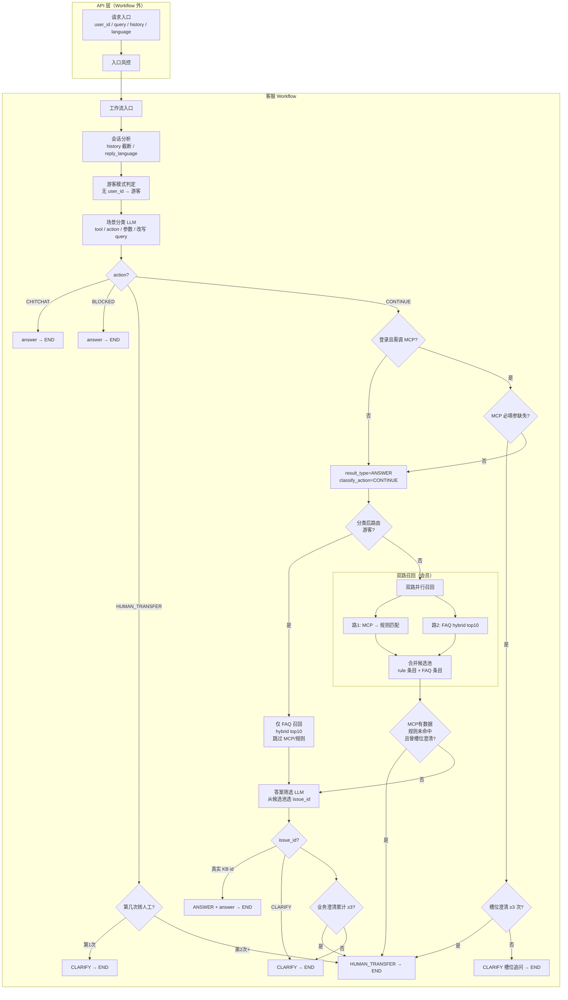
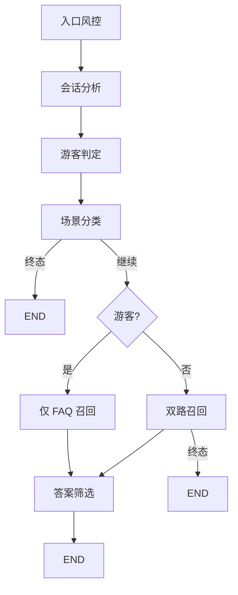
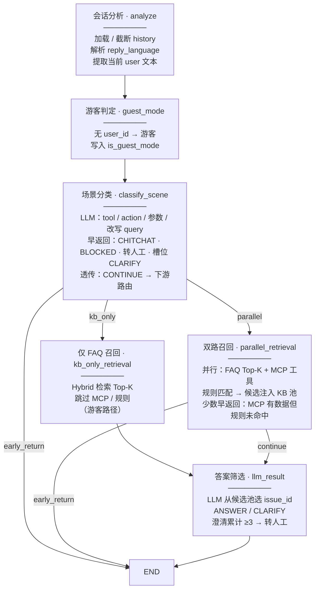
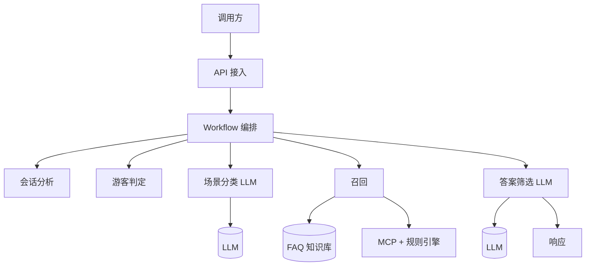
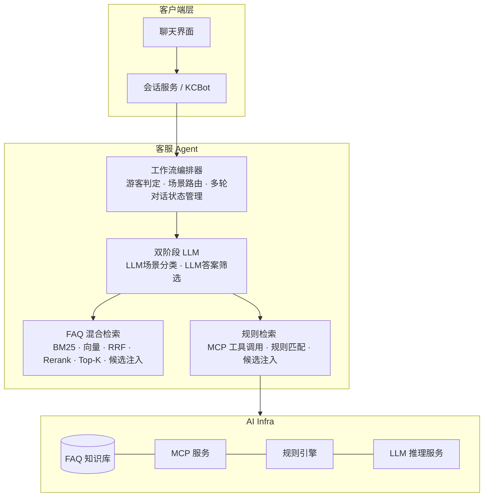

```mermaid
flowchart TB
    subgraph API["API 层（Workflow 外）"]
        IN[请求入口<br/>user_id / query / history / language]
        GUARD[入口风控]
    end

    IN --> GUARD --> START

    subgraph WF["客服 Workflow"]
        START[工作流入口] --> A1[会话分析<br/>history 截断 / reply_language]
        A1 --> A2[游客模式判定<br/>无 user_id → 游客]
        A2 --> CLS[场景分类 LLM<br/>tool / action / 参数 / 改写 query]

        CLS --> ACT{action?}

        ACT -->|CHITCHAT| E1[answer → END]
        ACT -->|BLOCKED| E2[answer → END]
        ACT -->|HUMAN_TRANSFER| HT1{第几次转人工?}
        HT1 -->|第1次| E3[CLARIFY → END]
        HT1 -->|第2次+| E4[HUMAN_TRANSFER → END]

        ACT -->|CONTINUE| C1{登录且需调 MCP?}
        C1 -->|否| PAS[result_type=ANSWER<br/>classify_action=CONTINUE]
        C1 -->|是| C2{MCP 必填参缺失?}
        C2 -->|是| C3{槽位澄清 ≥3 次?}
        C3 -->|是| E4
        C3 -->|否| E5[CLARIFY 槽位追问 → END]
        C2 -->|否| PAS

        PAS --> RT{分类后路由<br/>游客?}
        RT -->|是| KB[仅 FAQ 召回<br/>hybrid top10<br/>跳过 MCP/规则]
        RT -->|否| PAR[双路并行召回]

        subgraph PAR_DETAIL["双路召回（会员）"]
            PAR --> P1[路1: MCP → 规则匹配]
            PAR --> P2[路2: FAQ hybrid top10]
            P1 --> MERGE[合并候选池<br/>rule 条目 + FAQ 条目]
            P2 --> MERGE
        end

        MERGE --> PM{MCP有数据<br/>规则未命中<br/>且曾槽位澄清?}
        PM -->|是| E4
        PM -->|否| LLM

        KB --> LLM[答案筛选 LLM<br/>从候选池选 issue_id]

        LLM --> OUT{issue_id?}
        OUT -->|真实 KB id| E6[ANSWER + answer → END]
        OUT -->|CLARIFY| E7[CLARIFY → END]
        OUT --> CL3{业务澄清累计 ≥3?}
        CL3 -->|是| E4
        CL3 -->|否| E7
    end
```

```mermaid
flowchart TB
    IN[入口风控] --> A[会话分析]
    A --> G[游客判定]
    G --> C[场景分类]
    C -->|终态| END1[END]
    C -->|继续| R{游客?}
    R -->|是| K[仅 FAQ 召回]
    R -->|否| P[双路召回]
    K --> L[答案筛选]
    P -->|终态| END2[END]
    P --> L
    L --> END3[END]
```

```mermaid
flowchart TB
    A["会话分析 · analyze<br/>────────<br/>加载 / 截断 history<br/>解析 reply_language<br/>提取当前 user 文本"]
    
    G["游客判定 · guest_mode<br/>────────<br/>无 user_id → 游客<br/>写入 is_guest_mode"]
    
    C["场景分类 · classify_scene<br/>────────<br/>LLM：tool / action / 参数 / 改写 query<br/>早返回：CHITCHAT · BLOCKED · 转人工 · 槽位 CLARIFY<br/>透传：CONTINUE → 下游路由"]
    
    K["仅 FAQ 召回 · kb_only_retrieval<br/>────────<br/>Hybrid 检索 Top-K<br/>跳过 MCP / 规则<br/>（游客路径）"]
    
    P["双路召回 · parallel_retrieval<br/>────────<br/>并行：FAQ Top-K + MCP 工具<br/>规则匹配 → 候选注入 KB 池<br/>少数早返回：MCP 有数据但规则未命中"]
    
    L["答案筛选 · llm_result<br/>────────<br/>LLM 从候选池选 issue_id<br/>ANSWER / CLARIFY<br/>澄清累计 ≥3 → 转人工"]
    
    END[END]

    A --> G --> C
    C -->|early_return| END
    C -->|kb_only| K
    C -->|parallel| P
    K --> L
    P -->|early_return| END
    P -->|continue| L
    L --> END

```

```mermaid
flowchart TB
    Client[调用方] --> API[API 接入]
    API --> WF[Workflow 编排]

    WF --> N1[会话分析]
    WF --> N2[游客判定]
    WF --> N3[场景分类 LLM]
    WF --> N4[召回]
    WF --> N5[答案筛选 LLM]

    N3 --> LLM1[(LLM)]
    N5 --> LLM2[(LLM)]

    N4 --> KB[(FAQ 知识库)]
    N4 --> MCP[MCP + 规则引擎]

    N5 --> OUT[响应]
```

```mermaid
flowchart TB
    subgraph Client["客户端层"]
        direction LR
        A1[聊天界面] --> A2[会话服务 / KCBot]
    end

    subgraph Agent["客服 Agent"]
        C1[工作流编排器<br/>游客判定 · 场景路由 · 多轮对话状态管理]
        C2[双阶段 LLM<br/>LLM场景分类 · LLM答案筛选]
        C3[FAQ 混合检索<br/>BM25 · 向量 · RRF · Rerank · Top-K · 候选注入]
        C4[规则检索 <br/>MCP 工具调用 · 规则匹配 · 候选注入]
        C1 --> C2 --> C3
        C2 --> C4
    end

    subgraph Infra["AI Infra"]
        D1[(FAQ 知识库)]
        D2[MCP 服务]
        D3[规则引擎]
        D4[LLM 推理服务]
        D1 --- D2 --- D3 --- D4
    end

    A2 --> C1
    C4 --> Infra
```

