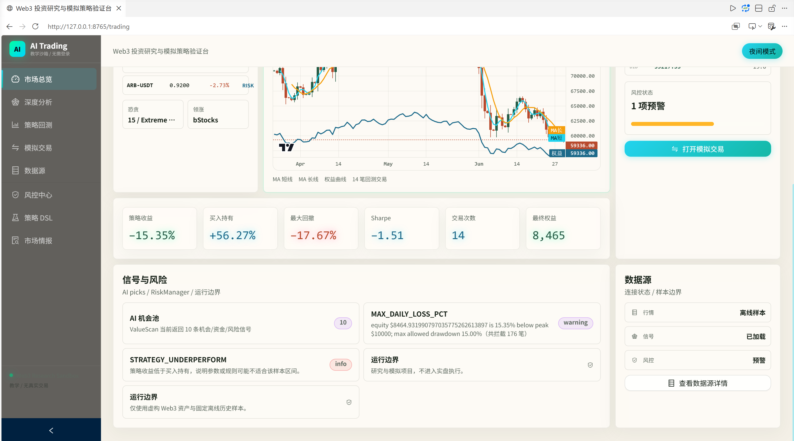
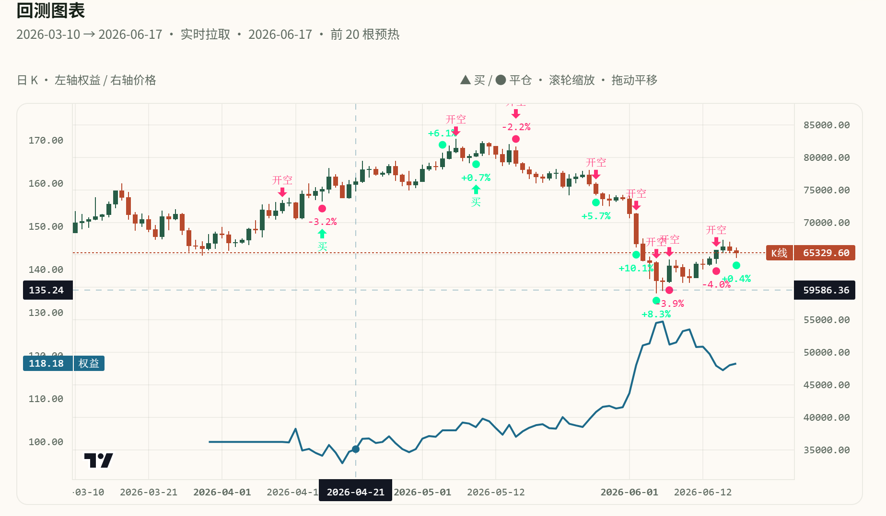

# web3-quant-sandbox

[中文](README.md) | [English](README.en.md)

`web3-quant-sandbox` is an open source sandbox for Web3 quantitative research, teaching demos, and local simulated trading. By default, it runs on offline samples and local snapshots included in this repository. It does not connect to real trading accounts, manage wallets, or place real orders.

This repository is also the companion workspace for a Codex delivery course. Course chapters, example commands, and runnable code should stay aligned: files, commands, and paths mentioned in the docs should exist and work in this repository.

## License

This project is released under the MIT License. See [LICENSE](LICENSE).

Author: Yuan Congde

Contact: congdeyuan@gmail.com

## Preview





## Core Features

| Feature | Web route | Main code paths | Notes |
| --- | --- | --- | --- |
| Market dashboard | `/trading` | `src/dashboard/`, `src/web/src/pages/trading/DashboardPage.tsx` | Multi-asset quotes, K-line charts, trading signals, risk summaries, and execution entry points |
| Opportunity radar | `/radar` | `src/dashboard/opportunity.py` | Scans opportunities with fund flow, trend, on-chain, and risk signals |
| Data source monitor | `/data-sources` | `src/dashboard/snapshot.py`, `src/dashboard/catalog.py` | Shows samples, snapshots, and online API status |
| Strategy backtests | `/backtests` | `src/backtest/`, `src/backtest/rolling/` | Single strategy tests, window comparison, walk-forward, portfolio, and robustness checks |
| Simulated trading | `/live-trading` | `src/strategy_engine/`, `src/risk/` | Sample-data-based simulated execution, not live trading |
| Risk center | `/risk` | `src/risk/`, `src/backtest/audit/` | Drawdown, stop loss, CPCV, PBO, DSR, and other risk views |
| Strategy DSL | `/strategy` | `src/strategy_engine/dsl/` | AST allowlist, import restrictions, look-ahead checks, and compile validation |
| Market research | `/research` | `src/research/`, `src/dashboard/llm_signal.py` | Research summaries, source cards, and optional LLM signal analysis |
| CLI report | None | `report_cli.py`, `src/research/report.py` | Outputs summary or JSON research reports |

## Quick Start

### Requirements

- Python 3.11.9 (the version used by the current `.venv`)
- Node.js 18+
- npm

### Windows PowerShell

```powershell
py scripts/course.py setup
py app.py
```

If the `py` launcher is not available, use:

```powershell
python scripts/course.py setup
python app.py
```

Then open:

```text
http://127.0.0.1:8765
```

The root path opens the frontend app. Main pages include `/trading`, `/radar`, `/backtests`, `/risk`, `/strategy`, and `/research`.

### macOS / Linux

```bash
make setup
python app.py
```

## Frontend Development

In production mode, `app.py` serves `src/web/static/` directly. For frontend development, run Vite alongside the local backend:

```powershell
py app.py
cd src/web
npm run dev
```

Build the frontend separately:

```powershell
cd src/web
npm run build
```

## Data Modes

Dashboard data comes from three source types:

1. `data/dashboard/snapshots/`: snapshots captured from online sources.
2. `data/dashboard/*.json`: bundled offline samples that work without network access.
3. Online APIs: used only when API keys are configured and `DASHBOARD_DATA_MODE=auto` or `DASHBOARD_DATA_MODE=live` is enabled.

Common data commands:

| Command | Purpose |
| --- | --- |
| `py scripts/course.py snapshot` | Fetch dashboard data online and write snapshots |
| `py scripts/course.py sync-fixtures` | Sync full snapshots into bundled samples |
| `py scripts/course.py save-offline-data` | Fetch snapshots and sync offline samples |
| `py scripts/course.py build-fixtures` | Fill samples from snapshots or seed data |

Copy `.env.example` to `.env` if you need local configuration. Without API keys, the app still starts with offline samples.

## CLI Reports

```powershell
python report_cli.py --format summary
python report_cli.py --format json --short 3 --long 7
```

Reports are assembled by `src/research/report.py` from sample data, backtest metrics, risk checks, and execution-boundary notes.

## Project Structure

```text
.
├── app.py                     # Local HTTP server, default 127.0.0.1:8765
├── report_cli.py              # CLI research report
├── verify.py                  # Product verification entry point
├── scripts/
│   └── course.py              # setup / verify / check / snapshot tasks
├── src/
│   ├── backtest/              # Backtests, rolling windows, audit metrics
│   ├── config/                # Environment variables and upstream configuration
│   ├── dashboard/             # Market data, snapshots, opportunity scan, API adapters
│   ├── data/                  # Point-in-time data utilities
│   ├── factor_mining/         # Factor mining and factor backtests
│   ├── research/              # Research report assembly
│   ├── risk/                  # Risk rules and simulation boundaries
│   ├── strategy_engine/       # Event-driven strategy engine and DSL
│   ├── ta/                    # Technical indicator utilities
│   └── web/                   # React + Ant Design frontend
├── data/                      # Offline samples and dashboard snapshots
├── skills/                    # Codex skills developed in the course
├── tests/                     # pytest tests
├── outputs/                   # Generated outputs
└── reports/                   # Report artifacts
```

## Verification

During edits, run:

```powershell
py scripts/course.py verify
```

Before finishing repository-wide changes, run:

```powershell
py scripts/course.py check
```

`check` also runs the implementation matrix, vendor drift check, asset audit, and courseware check. After editing plot scripts, regenerate teaching figures:

```powershell
py scripts/course.py teaching-plots
```

## Safety Boundaries

- The project does not connect to real exchange accounts or wallets by default.
- `/live-trading` is a simulated trading UI, not a live trading terminal.
- The strategy DSL performs AST allowlist checks, import restrictions, and look-ahead bias checks.
- Online data is for research demos and backtest inputs only. It is not investment advice.
- API keys should be loaded from local `.env` files and must not be committed.

## Development Conventions

- Product code belongs in `src/`.
- Frontend code belongs in `src/web/`.
- Tests belong in `tests/`.
- Offline samples belong in `data/`.
- Generated files should preferably go into `outputs/` or `reports/`.
- Do not restore deleted legacy directories such as `app/`, `challenges/`, `harness-kit/`, or `labs/`.
